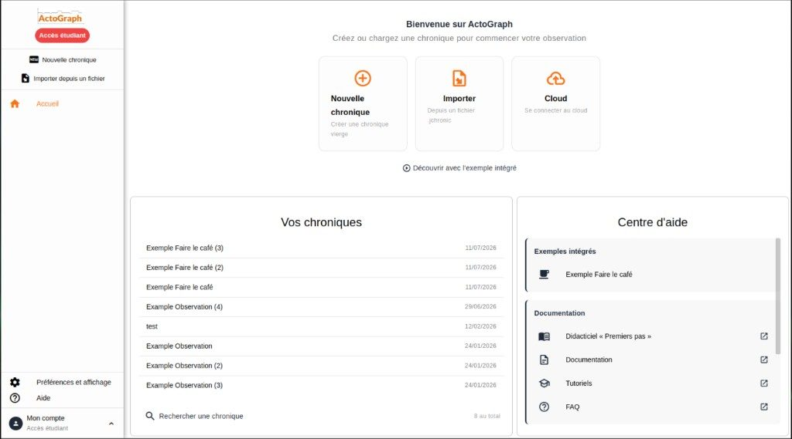
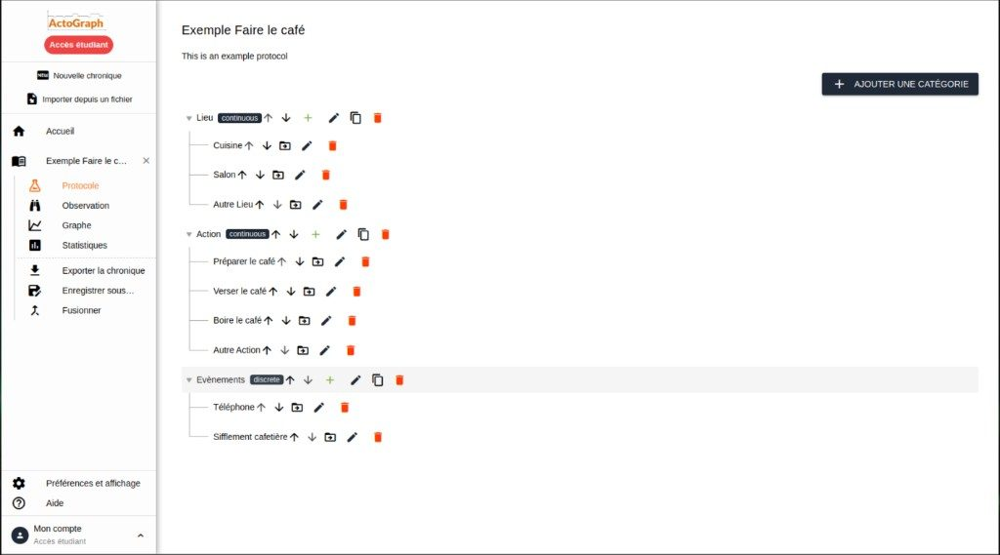
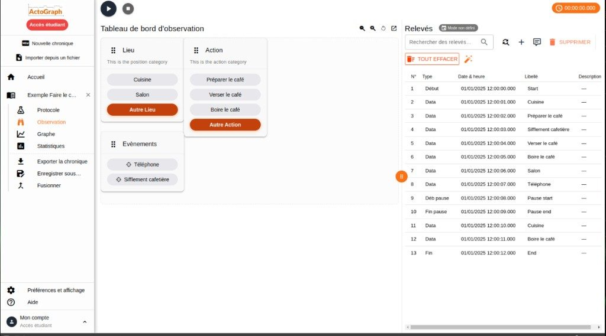
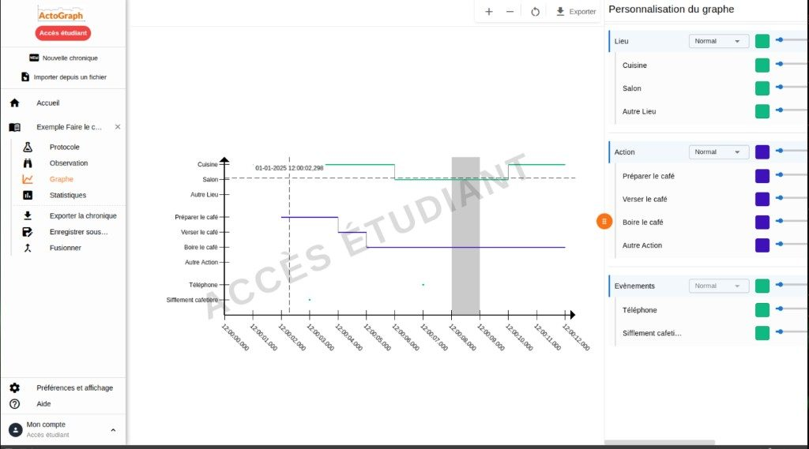

# ActoGraph v3

ActoGraph v3 est une application web et desktop conçue pour l'analyse et la visualisation de données d'observation comportementale. L'application permet de créer des observations, de collecter des données (readings), de définir des protocoles d'observation structurés et de visualiser les données sous forme de graphiques interactifs.

## Aperçu (desktop)

| Accueil | Protocole |
|---|---|
|  |  |

| Observation | Graphique d'activité |
|---|---|
|  |  |

## Téléchargement

La page de téléchargement officielle détecte votre système (Windows, macOS Apple Silicon/Intel, Linux) et propose le bon installeur directement :

**👉 https://syllll.github.io/actograph-v3/**

- **Étudiants** : utilisation gratuite, sans licence (contrairement à la V1).
- **Professionnels / non-étudiants** : une licence est requise, à acheter sur [actograph.io](https://www.actograph.io/fr/).

Les binaires sont publiés via les [GitHub Releases](https://github.com/Syllll/actograph-v3/releases) et signés par SymAlgo Technologies.

## Architecture

L'application est composée de deux parties principales :

- **Frontend** : Application Quasar/Vue.js 3 permettant une interface utilisateur moderne et réactive
- **Backend** : API NestJS avec TypeORM pour la gestion des données et la logique métier

L'application peut être déployée en mode :
- **Web** : Accessible via un navigateur web moderne
- **Desktop** : Application Electron pour Linux, macOS et Windows

## Prérequis

- Node.js (version 18 ou 20)
- Yarn (version 1.22+)
- Docker et Docker Compose (pour le développement web)
- PostgreSQL (pour la production) ou SQLite (pour le développement)

## Installation et démarrage

### Mode développement Web

Pour démarrer l'application en mode web avec Docker :

```bash
bash scripts/dev-web.sh
```

Cette commande démarre automatiquement :
- Le conteneur Docker de la base de données PostgreSQL
- Le conteneur Docker de l'API NestJS
- Le conteneur Docker du frontend Quasar

L'application sera accessible à l'adresse configurée dans les variables d'environnement (par défaut `http://localhost:9000`).

### Mode développement Electron

Pour démarrer l'application en mode desktop (Electron) :

```bash
bash scripts/dev-electron.sh
```

Cette commande démarre l'API en arrière-plan et lance l'application Electron.

### Configuration

Les fichiers de configuration se trouvent dans :
- `api/.env` : Configuration de l'API (base de données, JWT, etc.)
- `front/.env` : Configuration du frontend (URL de l'API, etc.)

Consultez les fichiers `.env.example` pour voir les variables nécessaires.

## Structure du projet

```
actograph-v3/
├── api/                    # Backend NestJS
│   ├── src/
│   │   ├── core/          # Modules métier principaux
│   │   │   ├── observations/  # Gestion des observations
│   │   │   ├── users/         # Gestion des utilisateurs
│   │   │   └── security/      # Sécurité et licences
│   │   ├── general/       # Modules généraux (auth, etc.)
│   │   └── utils/         # Utilitaires partagés
│   ├── migrations/        # Migrations TypeORM
│   └── docker/            # Configuration Docker
├── front/                 # Frontend Quasar/Vue.js (Web + Electron)
│   ├── src/
│   │   ├── pages/        # Pages de l'application
│   │   ├── components/   # Composants Vue
│   │   ├── services/     # Services API
│   │   └── composables/  # Composables Vue (ex. relevés, navigation / actions chronique, drawer)
│   └── lib-improba/      # Bibliothèque partagée
├── mobile/                # Application mobile Capacitor
│   ├── src/              # Code source mobile
│   └── src-capacitor/    # Configuration Capacitor (Android/iOS)
├── packages/              # Packages partagés (monorepo)
│   ├── core/             # @actograph/core - Logique métier pure
│   └── graph/            # @actograph/graph - Composant graphique PixiJS
└── docs/                  # Documentation détaillée
```

## Packages partagés

Le projet utilise des packages internes partagés entre les différentes applications :

### @actograph/core

Logique métier pure TypeScript, sans dépendance framework. Utilisé par :
- `api/` - Backend NestJS
- `front/` - Frontend web
- `mobile/` - Application mobile

Contient notamment : enums, types, statistiques, parsers de fichiers (ex. chronic v1), validation, utilitaires (`reading-auto-correct` : correction automatique des relevés avec codes `reason` stables et `AUTO_CORRECT_SYNTH_NAMES` pour les libellés synthétiques — à traduire côté appli via i18n).

```bash
# Build
cd packages/core && yarn build
```

```bash
# Tests unitaires (Jest)
cd packages/core && yarn test
```

### @actograph/graph

Composant de visualisation de graphiques utilisant PixiJS. Utilisé par :
- `front/` - Frontend web
- `mobile/` - Application mobile

Contient : rendu PixiJS, axes, affichage des readings.

```bash
# Build (nécessite @actograph/core buildé)
cd packages/graph && yarn build
```

### Configuration des packages

Les packages sont liés via `file:` dans les `package.json` :

```json
{
  "dependencies": {
    "@actograph/core": "file:../packages/core",
    "@actograph/graph": "file:../packages/graph"
  }
}
```

#### Faut-il builder les packages ?

**En développement : NON** ✅

Les alias TypeScript et Vite pointent directement vers `src/`, donc :
- Hot-reload automatique quand vous modifiez le code des packages
- Pas besoin de rebuilder après chaque modification
- Erreurs TypeScript visibles immédiatement

**En production : OUI** 🔨

Les builds utilisent `dist/` via les champs `main`/`types` des package.json.

```bash
# Builder tous les packages (nécessaire avant un build prod)
yarn build:packages

# Ou individuellement
yarn build:core
yarn build:graph
```

**Cas où il faut builder les packages :**
1. Avant un build de production (`yarn build:front`, `yarn build:mobile`)
2. Si vous utilisez les packages depuis un autre projet externe
3. Si les types ne se résolvent pas correctement dans l'IDE (rare)

## Concepts principaux

### Observations

Une **observation** est l'entité centrale de l'application. Elle représente une session d'observation comportementale et contient :
- Un protocole d'observation structuré
- Des readings (données collectées)
- Un graphique d'activité (optionnel)

### Protocoles

Un **protocole** définit la structure hiérarchique d'une observation. Il est composé de :
- **Catégories** : Groupes d'observables
- **Observables** : Éléments individuels à observer (feuilles de l'arbre)

### Readings

Les **readings** sont les données collectées lors d'une observation. Chaque reading contient :
- Un type (START, STOP, PAUSE_START, PAUSE_END, DATA)
- Une date et heure précise
- Un nom et une description optionnels

### Graphiques d'activité

Les **graphiques d'activité** visualisent les données d'observation sur un axe temporel, avec les observables du protocole sur l'axe vertical et le temps sur l'axe horizontal.

## Documentation détaillée

Pour plus d'informations sur des aspects spécifiques de l'application, consultez la documentation détaillée :

- **[Déploiement](docs/deployment.md)** : Instructions complètes pour déployer l'application en production
- **[Authentification](docs/authentification.md)** : Système d'authentification JWT et gestion des utilisateurs
- **[Chronic](docs/chronic.md)** : Import, export et création de données chroniques (readings)
- **[Protocoles](docs/protocol.md)** : Création et gestion des protocoles d'observation
- **[Readings](docs/reading.md)** : Gestion des readings et synchronisation
- **[Graphiques](docs/graph.md)** : Visualisation des données avec PixiJS

## Commandes utiles

### Backend (API)

Toutes les commandes backend doivent être exécutées dans le conteneur Docker `actograph-v3-api-dev` :

```bash
# Accéder à la console du conteneur API
sh api/docker/compose.sh console

# Exécuter les migrations
docker compose --env-file ./api/docker/../.env -f ./api/docker/docker-compose.dev.yml exec actograph-v3-api-dev yarn migration:run

# Installer les dépendances
docker compose --env-file ./api/docker/../.env -f ./api/docker/docker-compose.dev.yml exec actograph-v3-api-dev yarn install
```

### Frontend

Toutes les commandes frontend doivent être exécutées dans le conteneur Docker `actograph-v3-front-dev` :

```bash
# Accéder à la console du conteneur Frontend
sh front/docker/compose.sh console

# Installer les dépendances
docker compose --env-file ./front/docker/../.env -f ./front/docker/docker-compose.dev.yml exec actograph-v3-front-dev yarn install
```

## Déploiement

Pour déployer l'application en production :

```bash
bash scripts/publish.sh prod [major|minor|patch]
```

Cette commande :
1. Incrémente la version dans les `package.json`
2. Crée un commit avec la nouvelle version
3. Crée un tag Git au format `prod-vX.Y.Z`
4. Déclenche le pipeline CI/CD pour le déploiement

Consultez [deployment.md](docs/deployment.md) pour plus de détails.

## Technologies utilisées

### Backend
- **NestJS** : Framework Node.js pour l'API
- **TypeORM** : ORM pour la gestion de la base de données
- **PostgreSQL/SQLite** : Bases de données
- **JWT** : Authentification par tokens
- **Passport** : Middleware d'authentification

### Frontend
- **Quasar Framework** : Framework Vue.js pour applications web et desktop
- **Vue.js 3** : Framework JavaScript réactif
- **TypeScript** : Typage statique
- **PixiJS** : Bibliothèque de rendu graphique 2D pour les graphiques
- **Axios** : Client HTTP

## Contribution

Pour contribuer au projet, veuillez :
1. Créer une branche depuis `main`
2. Effectuer vos modifications
3. Créer une pull request avec une description détaillée

## Licence

ActoGraph v3 est la propriété exclusive de **SymAlgo Technologies**. Le code source est disponible en open source sous une licence dual avec les conditions suivantes :

### 🎓 Utilisation par les étudiants

Le code source d'ActoGraph v3 peut être utilisé **librement par les étudiants** à des fins éducatives et non commerciales. Les étudiants peuvent :
- Utiliser le logiciel dans le cadre de leurs activités académiques
- Étudier, modifier et adapter le code source
- Partager le code modifié avec d'autres étudiants ou enseignants dans un contexte éducatif

### 🏢 Utilisation par les entreprises

**Toute utilisation par des entreprises est strictement interdite** sans l'obtention préalable d'une licence commerciale auprès de SymAlgo Technologies.

**Modèle de licence par utilisateur :**
- **1 licence = 1 utilisateur** : Chaque licence commerciale est accordée pour un seul utilisateur
- **Plusieurs utilisateurs = plusieurs licences** : Si votre entreprise a besoin de plusieurs utilisateurs, une licence distincte est requise pour chaque utilisateur
- Le partage d'une licence entre plusieurs utilisateurs est strictement interdit

Une licence commerciale est requise pour :
- Toute utilisation à des fins commerciales ou professionnelles
- Toute utilisation dans un contexte commercial, même si elle n'est pas directement monétisée
- Toute intégration dans des produits ou services commerciaux
- Toute utilisation par des consultants ou prestataires de services

### 📄 Détails complets

Pour plus d'informations sur les conditions d'utilisation, consultez le fichier [LICENSE](LICENSE) à la racine du projet.

**Pour obtenir une licence commerciale**, veuillez contacter SymAlgo Technologies :
- Site web : https://actograph.io

## Support

Pour toute question ou problème, contactez l'équipe de développement.
