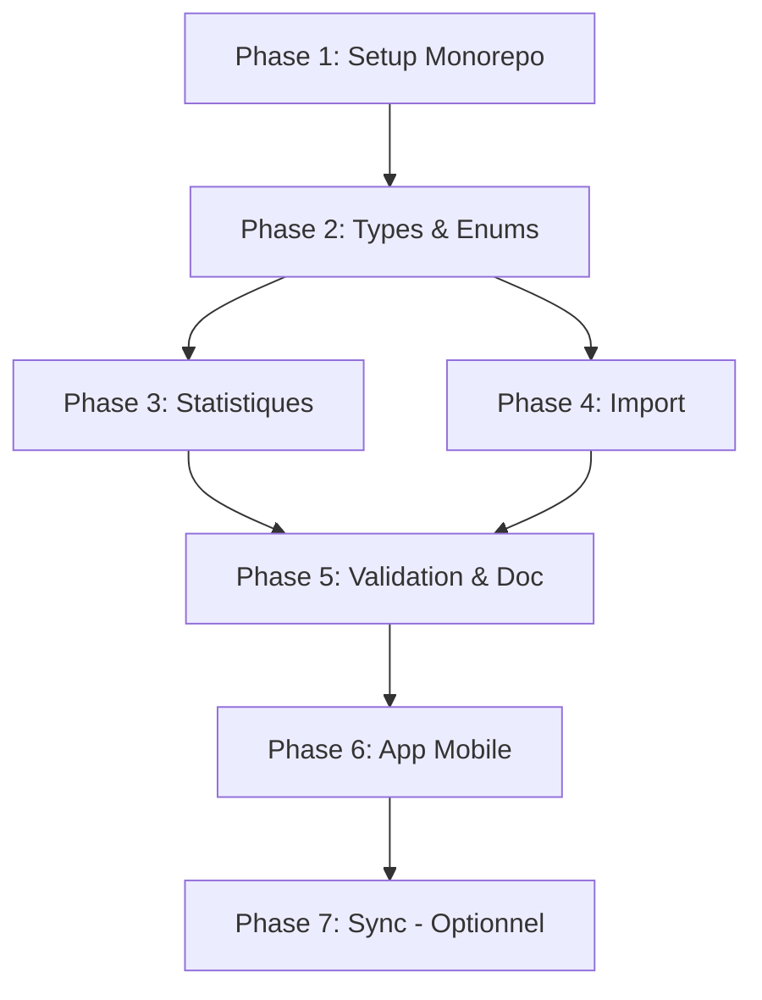

# Architecture Monorepo pour Application Mobile Offline

## 📋 Résumé

**Objectif** : Transformer ActoGraph v3 en architecture monorepo permettant de partager la logique métier entre le backend NestJS (web) et une future application mobile Capacitor fonctionnant 100% offline.

**Approche** : Extraire la logique métier pure (statistiques, import/export, validation) dans un package TypeScript partagé `@actograph/core`, utilisable par le backend et l'app mobile.

---

## 🎯 Objectifs

1. **Réutilisabilité** : Une seule implémentation de la logique métier
2. **Maintenabilité** : Bug fix dans core = corrigé partout
3. **Testabilité** : Tests unitaires partagés
4. **Mobile offline** : App Capacitor autonome avec SQLite local
5. **Cohérence** : Types et interfaces TypeScript partagés

---

## 📊 Analyse de l'existant

### Logique extractible (PURE - sans I/O)

| Module | Complexité | Lignes | Priorité |
|--------|------------|--------|----------|
| Statistiques générales | Haute | ~150 | P1 |
| Statistiques catégorie | Haute | ~200 | P1 |
| Statistiques conditionnelles | Haute | ~250 | P1 |
| Calcul périodes/pauses | Moyenne | ~150 | P1 |
| Parser Chronic v1 | Haute | ~500 | P2 |
| Convertisseurs Chronic v1 | Moyenne | ~200 | P2 |
| Parser jchronic (JSON) | Faible | ~100 | P2 |
| Validation protocole | Faible | ~50 | P3 |

### Logique NON extractible (dépend de l'I/O)

| Module | Raison |
|--------|--------|
| Repositories TypeORM | Spécifique PostgreSQL |
| Services NestJS (orchestration) | Framework-specific |
| Guards/Auth | Spécifique backend |
| Cron tasks | Spécifique backend |

---

## 🏗️ Architecture cible

```
actograph-v3/
├── packages/
│   └── core/                           # Package partagé @actograph/core
│       ├── package.json
│       ├── tsconfig.json
│       ├── jest.config.js
│       ├── src/
│       │   ├── index.ts                # Point d'entrée (exports)
│       │   │
│       │   ├── types/                  # Interfaces TypeScript
│       │   │   ├── index.ts
│       │   │   ├── observation.types.ts
│       │   │   ├── protocol.types.ts
│       │   │   ├── reading.types.ts
│       │   │   └── statistics.types.ts
│       │   │
│       │   ├── enums/                  # Enums partagés
│       │   │   ├── index.ts
│       │   │   ├── reading-type.enum.ts
│       │   │   ├── protocol-item.enum.ts
│       │   │   └── observation.enum.ts
│       │   │
│       │   ├── statistics/             # Logique statistiques (PURE)
│       │   │   ├── index.ts
│       │   │   ├── period-calculator.ts
│       │   │   ├── general-statistics.ts
│       │   │   ├── category-statistics.ts
│       │   │   └── conditional-statistics.ts
│       │   │
│       │   ├── import/                 # Parsers et convertisseurs
│       │   │   ├── index.ts
│       │   │   ├── jchronic-parser.ts
│       │   │   └── chronic-v1/
│       │   │       ├── parser/
│       │   │       ├── converter/
│       │   │       ├── qtdatastream/
│       │   │       └── types/
│       │   │
│       │   └── validation/             # Règles de validation
│       │       ├── index.ts
│       │       ├── observation.validation.ts
│       │       └── protocol.validation.ts
│       │
│       └── __tests__/                  # Tests unitaires
│           ├── statistics/
│           └── import/
│
├── api/                                # Backend NestJS (adapté)
│   ├── package.json                    # Dépendance vers @actograph/core
│   └── src/
│       └── core/
│           └── observations/
│               ├── entities/           # Garde les décorateurs TypeORM
│               └── services/           # Utilise @actograph/core
│
├── front/                              # Frontend Quasar (web)
│   └── package.json                    # Peut utiliser @actograph/core
│
└── mobile/                             # App Capacitor (NOUVEAU)
    ├── capacitor.config.ts
    ├── package.json                    # Dépendance vers @actograph/core
    ├── android/
    ├── ios/
    └── src/
        ├── database/                   # Couche SQLite
        │   ├── sqlite.service.ts
        │   ├── schema.ts
        │   ├── migrations/
        │   └── repositories/
        └── services/                   # Utilise @actograph/core
```

---

## 📝 Plan d'implémentation

### Phase 1 : Setup du Monorepo

**Durée estimée** : 1-2 jours

- [ ] **1.1** Initialiser la structure monorepo
  - [ ] Choisir l'outil de gestion (yarn workspaces recommandé, simple et natif)
  - [ ] Configurer le `package.json` racine avec workspaces
  - [ ] Vérifier que les projets existants (`api/`, `front/`) fonctionnent toujours

- [ ] **1.2** Créer le package `@actograph/core`
  - [ ] Créer `packages/core/`
  - [ ] Créer `packages/core/package.json`
  - [ ] Créer `packages/core/tsconfig.json` (configuration TypeScript stricte)
  - [ ] Créer `packages/core/src/index.ts` (point d'entrée vide pour l'instant)

- [ ] **1.3** Configurer les dépendances inter-packages
  - [ ] Ajouter `@actograph/core` comme dépendance dans `api/package.json`
  - [ ] Configurer les paths TypeScript dans `api/tsconfig.json`
  - [ ] Vérifier la compilation du backend avec le package vide

- [ ] **1.4** Configurer les scripts de build
  - [ ] Script `build` dans `packages/core` (tsc)
  - [ ] Script `build:all` à la racine
  - [ ] Script `dev` qui watch les changements

**Livrables** :
- Structure monorepo fonctionnelle
- Package `@actograph/core` vide mais importable
- Backend qui compile avec la dépendance

---

### Phase 2 : Extraction des Types et Enums

**Durée estimée** : 1 jour

- [ ] **2.1** Créer les enums partagés
  - [ ] `packages/core/src/enums/reading-type.enum.ts`
    - Extraire `ReadingTypeEnum` depuis `api/src/core/observations/entities/reading.entity.ts`
  - [ ] `packages/core/src/enums/protocol-item.enum.ts`
    - Extraire `ProtocolItemTypeEnum` depuis `api/src/core/observations/entities/protocol.entity.ts`
    - Extraire `ProtocolItemActionEnum`
    - Extraire `BackgroundPatternEnum`
    - Extraire `DisplayModeEnum`
  - [ ] `packages/core/src/enums/observation.enum.ts`
    - Extraire `ObservationType` depuis `api/src/core/observations/entities/observation.entity.ts`
    - Extraire `ObservationModeEnum`
  - [ ] `packages/core/src/enums/index.ts` - Barrel export

- [ ] **2.2** Créer les interfaces partagées
  - [ ] `packages/core/src/types/reading.types.ts`
    - Interface `IReading` (sans décorateurs TypeORM)
  - [ ] `packages/core/src/types/protocol.types.ts`
    - Interface `IProtocolItem`
    - Interface `IProtocol`
    - Interface `IGraphPreferences`
  - [ ] `packages/core/src/types/observation.types.ts`
    - Interface `IObservation`
  - [ ] `packages/core/src/types/statistics.types.ts`
    - Interface `IPeriod`
    - Interface `IObservableStatistics`
    - Interface `ICategoryStatistics`
    - Interface `IGeneralStatistics`
    - Interface `IConditionalStatistics`
  - [ ] `packages/core/src/types/index.ts` - Barrel export

- [ ] **2.3** Mettre à jour le backend pour utiliser les types du core
  - [ ] Modifier les entités pour importer les enums depuis `@actograph/core`
  - [ ] Garder les décorateurs TypeORM dans les entités
  - [ ] Vérifier que la compilation fonctionne
  - [ ] Vérifier que les migrations fonctionnent toujours

- [ ] **2.4** Mettre à jour le point d'entrée
  - [ ] `packages/core/src/index.ts` - Exporter tous les types et enums

**Livrables** :
- Tous les enums dans `@actograph/core`
- Toutes les interfaces dans `@actograph/core`
- Backend utilisant les types du core
- Aucune régression fonctionnelle

---

### Phase 3 : Extraction de la Logique Statistiques

**Durée estimée** : 2-3 jours

Cette phase est la plus critique car elle contient ~600 lignes de logique métier complexe.

- [ ] **3.1** Extraire le calculateur de périodes
  - [ ] `packages/core/src/statistics/period-calculator.ts`
    - Fonction `calculatePausePeriods(readings: IReading[]): IPeriod[]`
    - Fonction `calculatePauseOverlap(start, end, pausePeriods): number`
    - Fonction `intersectPeriods(periodArrays: IPeriod[][]): IPeriod[]`
    - Fonction `unionPeriods(periodArrays: IPeriod[][]): IPeriod[]`
    - Fonction `intersectTwoPeriods(p1, p2): IPeriod | null`
    - Fonction `filterByTimeRange(periods, startTime?, endTime?): IPeriod[]`
  - [ ] Écrire les tests unitaires pour chaque fonction

- [ ] **3.2** Extraire les statistiques de catégorie
  - [ ] `packages/core/src/statistics/category-statistics.ts`
    - Fonction `calculateContinuousObservableDurations(...): { onDuration, onCount }`
    - Fonction `calculateDiscreteObservableCount(observableName, readings): number`
    - Fonction `calculateCategoryStatistics(category, readings, start, end): ICategoryStatistics`
  - [ ] Écrire les tests unitaires

- [ ] **3.3** Extraire les statistiques générales
  - [ ] `packages/core/src/statistics/general-statistics.ts`
    - Fonction `calculateGeneralStatistics(observation, readings, protocol): IGeneralStatistics`
    - Fonction `calculateCategorySummaries(protocol, readings, totalDuration): ICategorySummary[]`
  - [ ] Écrire les tests unitaires

- [ ] **3.4** Extraire les statistiques conditionnelles
  - [ ] `packages/core/src/statistics/conditional-statistics.ts`
    - Fonction `applyConditions(readings, conditionGroups, operator): IPeriod[]`
    - Fonction `applyConditionGroup(readings, group): IPeriod[]`
    - Fonction `findObservablePeriods(readings, name, state, categoryNames): IPeriod[]`
    - Fonction `calculateConditionalStatistics(observation, request): IConditionalStatistics`
  - [ ] Écrire les tests unitaires

- [ ] **3.5** Créer le barrel export
  - [ ] `packages/core/src/statistics/index.ts`

- [ ] **3.6** Refactorer `StatisticsService` du backend
  - [ ] Remplacer les méthodes privées par des imports depuis `@actograph/core`
  - [ ] Le service devient un "orchestrateur" : fetch data → call core → return
  - [ ] Supprimer le code dupliqué
  - [ ] Garder le logging NestJS

- [ ] **3.7** Tests d'intégration
  - [ ] Vérifier que les endpoints de statistiques retournent les mêmes résultats
  - [ ] Comparer avec des données de test connues

**Livrables** :
- Module `statistics/` complet dans `@actograph/core`
- Tests unitaires avec couverture > 80%
- Backend refactoré utilisant le core
- Aucune régression sur les statistiques

---

### Phase 4 : Extraction des Parsers Import

**Durée estimée** : 1-2 jours

Les parsers sont déjà bien isolés, cette phase est principalement du déplacement de fichiers.

- [ ] **4.1** Déplacer le parser Chronic v1
  - [ ] Copier `api/src/core/observations/services/observation/import/chronic-v1/` vers `packages/core/src/import/chronic-v1/`
  - [ ] Adapter les imports pour utiliser les types du core
  - [ ] Vérifier que le parser compile indépendamment

- [ ] **4.2** Extraire le parser jchronic
  - [ ] `packages/core/src/import/jchronic-parser.ts`
    - Fonction `parseJchronicFile(content: string): IJchronicImport`
    - Fonction `normalizeJchronicData(data): INormalizedImport`
  - [ ] Adapter pour utiliser les types du core

- [ ] **4.3** Créer les types d'import
  - [ ] `packages/core/src/import/types.ts`
    - Interface `IJchronicImport`
    - Interface `IChronicV1Import`
    - Interface `INormalizedImport`

- [ ] **4.4** Créer le barrel export
  - [ ] `packages/core/src/import/index.ts`

- [ ] **4.5** Refactorer la classe `Import` du backend
  - [ ] Utiliser les parsers et convertisseurs depuis `@actograph/core`
  - [ ] La classe devient un orchestrateur

- [ ] **4.6** Tests
  - [ ] Porter les tests existants si présents
  - [ ] Ajouter des tests avec des fichiers .chronic et .jchronic de référence

**Livrables** :
- Module `import/` complet dans `@actograph/core`
- Backend utilisant les parsers du core
- Import fonctionnel (tester avec vrais fichiers)

---

### Phase 5 : Validation et Documentation

**Durée estimée** : 1 jour

- [ ] **5.1** Créer le module de validation
  - [ ] `packages/core/src/validation/observation.validation.ts`
    - Fonction `validateObservationData(data): ValidationResult`
  - [ ] `packages/core/src/validation/protocol.validation.ts`
    - Fonction `validateProtocolStructure(items): ValidationResult`
  - [ ] `packages/core/src/validation/index.ts`

- [ ] **5.2** Documentation du package
  - [ ] `packages/core/README.md`
    - Description du package
    - Installation
    - API Reference
    - Exemples d'utilisation

- [ ] **5.3** Finaliser le point d'entrée
  - [ ] `packages/core/src/index.ts` - Export propre de toute l'API publique
  - [ ] Vérifier que l'arborescence d'imports est logique

- [ ] **5.4** Tests finaux du package
  - [ ] `yarn test` dans `packages/core`
  - [ ] Vérifier la couverture de code
  - [ ] Vérifier que le build produit des .d.ts corrects

**Livrables** :
- Package `@actograph/core` complet et documenté
- README avec exemples
- Build propre avec types TypeScript

---

### Phase 6 : Setup Application Mobile Capacitor

**Durée estimée** : 2-3 jours

- [ ] **6.1** Initialiser le projet mobile
  - [ ] Créer `mobile/` basé sur Quasar + Capacitor
  - [ ] `quasar create mobile --kit capacitor`
  - [ ] Configurer `capacitor.config.ts`

- [ ] **6.2** Configurer SQLite
  - [ ] Installer `@capacitor-community/sqlite`
  - [ ] Créer `mobile/src/database/sqlite.service.ts`
  - [ ] Définir le schéma de base de données (`schema.ts`)
  - [ ] Créer le système de migrations SQLite

- [ ] **6.3** Créer les repositories SQLite
  - [ ] `mobile/src/database/repositories/base.repository.ts`
  - [ ] `mobile/src/database/repositories/observation.repository.ts`
  - [ ] `mobile/src/database/repositories/protocol.repository.ts`
  - [ ] `mobile/src/database/repositories/reading.repository.ts`

- [ ] **6.4** Intégrer `@actograph/core`
  - [ ] Ajouter la dépendance dans `mobile/package.json`
  - [ ] Créer `mobile/src/services/statistics.service.ts` utilisant le core
  - [ ] Créer `mobile/src/services/import.service.ts` utilisant le core

- [ ] **6.5** Adapter le frontend
  - [ ] Copier les composants pertinents depuis `front/`
  - [ ] Adapter les services pour utiliser SQLite au lieu de l'API
  - [ ] Créer un système de "mode offline"

- [ ] **6.6** Tests sur device
  - [ ] Build Android
  - [ ] Build iOS (si Mac disponible)
  - [ ] Tester l'import de fichiers
  - [ ] Tester les statistiques

**Livrables** :
- App mobile Capacitor fonctionnelle
- SQLite local pour la persistance
- Import de fichiers .chronic/.jchronic
- Statistiques calculées localement

---

### Phase 7 : Synchronisation (Optionnelle)

**Durée estimée** : 3-5 jours (si nécessaire)

Cette phase est optionnelle et dépend des besoins futurs.

- [ ] **7.1** Définir la stratégie de sync
  - [ ] Sync unidirectionnelle (mobile → serveur) ?
  - [ ] Sync bidirectionnelle avec gestion de conflits ?
  - [ ] Quelles entités synchroniser ?

- [ ] **7.2** Implémenter la sync
  - [ ] API endpoints de sync côté backend
  - [ ] Service de sync côté mobile
  - [ ] Gestion des conflits
  - [ ] Queue de sync offline

- [ ] **7.3** UI de synchronisation
  - [ ] Indicateur de statut de sync
  - [ ] Bouton sync manuelle
  - [ ] Gestion des erreurs

**Livrables** :
- Sync fonctionnelle entre mobile et serveur
- Gestion des conflits
- Mode offline-first

---

## 📁 Fichiers à créer/modifier

### Nouveaux fichiers

```
packages/
└── core/
    ├── package.json
    ├── tsconfig.json
    ├── jest.config.js
    ├── README.md
    └── src/
        ├── index.ts
        ├── enums/
        │   ├── index.ts
        │   ├── reading-type.enum.ts
        │   ├── protocol-item.enum.ts
        │   └── observation.enum.ts
        ├── types/
        │   ├── index.ts
        │   ├── reading.types.ts
        │   ├── protocol.types.ts
        │   ├── observation.types.ts
        │   └── statistics.types.ts
        ├── statistics/
        │   ├── index.ts
        │   ├── period-calculator.ts
        │   ├── general-statistics.ts
        │   ├── category-statistics.ts
        │   └── conditional-statistics.ts
        ├── import/
        │   ├── index.ts
        │   ├── types.ts
        │   ├── jchronic-parser.ts
        │   └── chronic-v1/
        │       └── ... (copie depuis api)
        └── validation/
            ├── index.ts
            ├── observation.validation.ts
            └── protocol.validation.ts
```

### Fichiers à modifier

```
package.json (racine)          # Ajouter workspaces
api/package.json               # Ajouter dépendance @actograph/core
api/tsconfig.json              # Configurer paths

api/src/core/observations/entities/reading.entity.ts      # Importer enum depuis core
api/src/core/observations/entities/protocol.entity.ts     # Importer enums depuis core
api/src/core/observations/entities/observation.entity.ts  # Importer enums depuis core
api/src/core/observations/services/statistics.service.ts  # Utiliser fonctions du core
api/src/core/observations/services/observation/import/    # Utiliser parsers du core
```

---

## ⚠️ Points d'attention

### Risques identifiés

| Risque | Probabilité | Impact | Mitigation |
|--------|-------------|--------|------------|
| Régression statistiques | Moyenne | Élevé | Tests unitaires exhaustifs avant extraction |
| Incompatibilité types | Faible | Moyen | Utiliser `strict: true` dans tsconfig |
| Performance SQLite | Faible | Moyen | Benchmarks avec gros volumes de données |
| Build monorepo complexe | Moyenne | Faible | Utiliser yarn workspaces (simple) |

### Décisions à prendre

1. **Outil de monorepo** : yarn workspaces (recommandé) vs pnpm vs lerna vs nx
2. **Stratégie de versioning** : Version unique ou versions indépendantes ?
3. **Publication npm** : Package privé ou public ?
4. **Synchronisation** : Nécessaire pour la v1 mobile ?

---

## 📊 Estimation globale

| Phase | Durée estimée | Prérequis |
|-------|---------------|-----------|
| Phase 1 : Setup monorepo | 1-2 jours | - |
| Phase 2 : Types et enums | 1 jour | Phase 1 |
| Phase 3 : Statistiques | 2-3 jours | Phase 2 |
| Phase 4 : Import | 1-2 jours | Phase 2 |
| Phase 5 : Validation & doc | 1 jour | Phases 3-4 |
| Phase 6 : App mobile | 2-3 jours | Phase 5 |
| Phase 7 : Sync (optionnel) | 3-5 jours | Phase 6 |

**Total sans sync** : 8-12 jours de développement
**Total avec sync** : 11-17 jours de développement

---

## 🔄 Ordre d'exécution recommandé



Les phases 3 et 4 peuvent être parallélisées si plusieurs développeurs sont disponibles.

---

## ✅ Critères de succès

- [ ] Package `@actograph/core` publié et utilisable
- [ ] Backend utilisant le core sans régression
- [ ] Tests unitaires avec couverture > 80% sur le core
- [ ] App mobile fonctionnelle en mode offline
- [ ] Import de fichiers .chronic et .jchronic sur mobile
- [ ] Statistiques identiques entre web et mobile
- [ ] Documentation complète du package core


