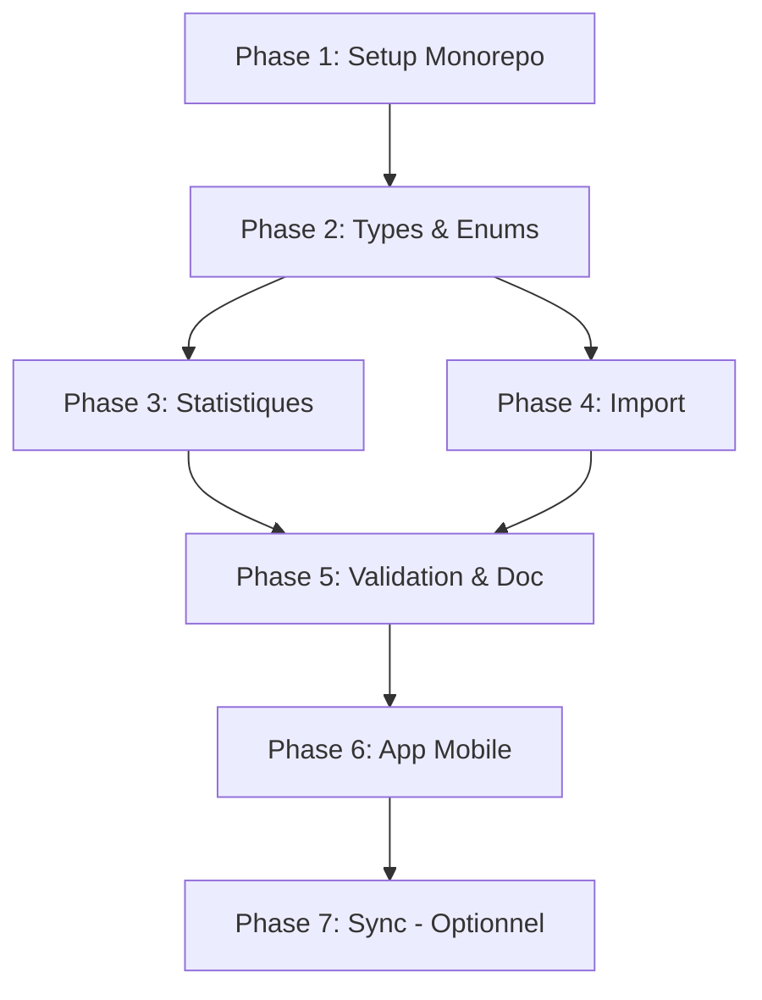

# Architecture Monorepo pour Application Mobile Offline

## 📋 Résumé

**Objectif** : Transformer ActoGraph v3 en architecture monorepo permettant de partager la logique métier entre le backend NestJS (web) et une future application mobile Capacitor fonctionnant 100% offline.

**Approche** : Extraire la logique métier pure (import/export, validation) dans un package TypeScript partagé `@actograph/core`, utilisable par le backend et l'app mobile.

**Fonctionnalités mobiles** : Version simplifiée de l'application web avec :
- ✅ Création et chargement de chroniques (observations)
- ✅ Observation en temps réel (mode chronomètre, pas de vidéo)
- ✅ Manipulation du protocole d'observation
- ✅ Visualisation du graphique d'activité (lecture seule, pas de customisation)
- ❌ Pas de statistiques
- ❌ Pas de customisation du graphique d'activité

### 📊 Avancement global

| Phase | Description | Statut |
|-------|-------------|--------|
| Phase 1 | Setup du Monorepo | ✅ Terminée |
| Phase 2 | Extraction Types et Enums | ✅ Terminée |
| Phase 3 | Extraction Logique Statistiques | ✅ Terminée |
| Phase 4 | Extraction Parsers Import | ✅ Terminée |
| Phase 5 | Validation et Documentation | ✅ Terminée |
| Phase 6 | Setup Application Mobile | ⏳ En cours (95%) |
| Phase 7 | Synchronisation | ❌ Annulée (100% local) |

**Dernière mise à jour** : Janvier 2025

---

## 🎯 Objectifs

1. **Réutilisabilité** : Une seule implémentation de la logique métier
2. **Maintenabilité** : Bug fix dans core = corrigé partout
3. **Testabilité** : Tests unitaires partagés
4. **Mobile offline** : App Capacitor autonome avec SQLite local
5. **Cohérence** : Types et interfaces TypeScript partagés

---

## 📱 Fonctionnalités Mobile vs Web

### Fonctionnalités disponibles sur mobile

| Fonctionnalité | Mobile | Web |
|----------------|--------|-----|
| **Créer/Charger une chronique** | ✅ | ✅ |
| **Observation en temps réel** | ✅ (Chronomètre uniquement) | ✅ (Chronomètre + Vidéo) |
| **Manipuler le protocole** | ✅ | ✅ |
| **Visualiser le graphique d'activité** | ✅ (Lecture seule) | ✅ (Avec customisation) |
| **Statistiques** | ❌ | ✅ |
| **Customisation graphique** | ❌ | ✅ |
| **Import fichiers .chronic/.jchronic** | ✅ | ✅ |
| **Mode offline** | ✅ (100% offline) | ❌ (Nécessite connexion) |
| **Licence requise** | ❌ (Gratuit) | ✅ |
| **Compte utilisateur** | ❌ (Pas nécessaire) | ✅ |
| **Synchronisation serveur** | ❌ (Données locales) | ✅ |

### Détails des limitations mobiles

**Observation en temps réel** :
- Mode chronomètre uniquement (pas de mode vidéo)
- Enregistrement des readings en temps réel
- Gestion des pauses (PAUSE_START, PAUSE_END)

**Graphique d'activité** :
- Visualisation en lecture seule
- Pas de personnalisation des couleurs
- Pas de modification des préférences d'affichage
- Pas de changement de mode d'affichage (catégorie/arrière-plan)

**Pas de statistiques** :
- Pas de calcul de statistiques générales
- Pas de statistiques par catégorie
- Pas de statistiques conditionnelles
- Les données restent disponibles pour une future synchronisation avec le web

---

## 📊 Analyse de l'existant

### Distinction importante : DTOs vs Interfaces

**DTOs NestJS** (resteront dans le backend) :
- Contiennent des décorateurs NestJS (`@Expose`, `@IsString`, `@IsEnum`, etc.)
- Utilisés pour la validation et la sérialisation HTTP
- Exemples : `GeneralStatisticsDto`, `CategoryStatisticsDto`, `ConditionalStatisticsRequestDto`

**Interfaces TypeScript** (seront dans `@actograph/core`) :
- Types purs sans décorateurs
- Réutilisables partout (backend, frontend, mobile)
- Exemples : `IGeneralStatistics`, `ICategoryStatistics`, `IConditionalStatisticsRequest`

**Stratégie** : Les DTOs NestJS utiliseront les interfaces du core comme structure interne, mais garderont leurs décorateurs pour la validation/sérialisation.

### Logique extractible (PURE - sans I/O)

| Module | Complexité | Lignes | Priorité |
|--------|------------|--------|----------|
| Statistiques générales | Haute | ~150 | P1 |
| Statistiques catégorie | Haute | ~200 | P1 |
| Statistiques conditionnelles | Haute | ~300 | P1 |
| Calcul périodes/pauses | Moyenne | ~150 | P1 |
| Parser Chronic v1 | Haute | ~500 | P2 |
| Convertisseurs Chronic v1 | Moyenne | ~200 | P2 |
| Parser jchronic (JSON) | Faible | ~100 | P2 |
| Validation protocole | Faible | ~50 | P3 |

### Logique NON extractible (dépend de l'I/O)

| Module | Raison |
|--------|--------|
| Repositories TypeORM | Spécifique PostgreSQL |
| Services NestJS (orchestration) | Framework-specific |
| Guards/Auth | Spécifique backend |
| Cron tasks | Spécifique backend |

---

## 🏗️ Architecture cible

```
actograph-v3/
├── packages/
│   └── core/                           # Package partagé @actograph/core
│       ├── package.json
│       ├── tsconfig.json
│       ├── jest.config.js
│       ├── src/
│       │   ├── index.ts                # Point d'entrée (exports)
│       │   │
│       │   ├── types/                  # Interfaces TypeScript
│       │   │   ├── index.ts
│       │   │   ├── observation.types.ts
│       │   │   ├── protocol.types.ts
│       │   │   ├── reading.types.ts
│       │   │   └── statistics.types.ts
│       │   │
│       │   ├── enums/                  # Enums partagés
│       │   │   ├── index.ts
│       │   │   ├── reading-type.enum.ts
│       │   │   ├── protocol-item.enum.ts
│       │   │   └── observation.enum.ts
│       │   │
│       │   ├── statistics/             # Logique statistiques (PURE)
│       │   │   ├── index.ts
│       │   │   ├── period-calculator.ts
│       │   │   ├── general-statistics.ts
│       │   │   ├── category-statistics.ts
│       │   │   └── conditional-statistics.ts
│       │   │
│       │   ├── import/                 # Parsers et convertisseurs
│       │   │   ├── index.ts
│       │   │   ├── jchronic-parser.ts
│       │   │   └── chronic-v1/
│       │   │       ├── parser/
│       │   │       ├── converter/
│       │   │       ├── qtdatastream/
│       │   │       └── types/
│       │   │
│       │   └── validation/             # Règles de validation
│       │       ├── index.ts
│       │       ├── observation.validation.ts
│       │       └── protocol.validation.ts
│       │
│       └── __tests__/                  # Tests unitaires
│           ├── statistics/
│           └── import/
│
├── api/                                # Backend NestJS (adapté)
│   ├── package.json                    # Dépendance vers @actograph/core
│   └── src/
│       └── core/
│           └── observations/
│               ├── entities/           # Garde les décorateurs TypeORM
│               └── services/           # Utilise @actograph/core
│
├── front/                              # Frontend Quasar (web)
│   └── package.json                    # Peut utiliser @actograph/core
│
└── mobile/                             # App Capacitor (NOUVEAU)
    ├── capacitor.config.ts
    ├── package.json                    # Dépendance vers @actograph/core
    ├── android/
    ├── ios/
    └── src/
        ├── database/                   # Couche SQLite
        │   ├── sqlite.service.ts
        │   ├── schema.ts
        │   ├── migrations/
        │   └── repositories/
        ├── services/                   # Utilise @actograph/core
        │   ├── import.service.ts       # Import fichiers .chronic/.jchronic
        │   ├── validation.service.ts   # Validation données
        │   ├── observation.service.ts  # CRUD observations
        │   └── protocol.service.ts    # CRUD protocoles
        ├── pages/                     # Pages Vue
        │   ├── observations/          # Liste et édition observations
        │   └── import/                # Import de fichiers
        └── components/                # Composants Vue
            ├── Chronometer.vue        # Chronomètre observation temps réel
            ├── ProtocolEditor.vue    # Éditeur protocole
            └── ActivityGraphViewer.vue # Visualisation graph (lecture seule)
```

---

## 📝 Plan d'implémentation

### Phase 1 : Setup du Monorepo ✅ TERMINÉE

**Durée estimée** : 1-2 jours

- [x] **1.1** Initialiser la structure monorepo
  - [x] Choisir l'outil de gestion (yarn workspaces recommandé, simple et natif)
  - [x] Configurer le `package.json` racine avec workspaces
  - [x] Vérifier que les projets existants (`api/`, `front/`) fonctionnent toujours

- [x] **1.2** Créer le package `@actograph/core`
  - [x] Créer `packages/core/`
  - [x] Créer `packages/core/package.json`
  - [x] Créer `packages/core/tsconfig.json` (configuration TypeScript stricte)
  - [x] Créer `packages/core/src/index.ts` (point d'entrée vide pour l'instant)

- [x] **1.3** Configurer les dépendances inter-packages
  - [x] Ajouter `@actograph/core` comme dépendance dans `api/package.json`
  - [x] Configurer les paths TypeScript dans `api/tsconfig.json`
  - [x] Vérifier la compilation du backend avec le package vide

- [x] **1.4** Configurer les scripts de build
  - [x] Script `build` dans `packages/core` (tsc)
  - [x] Script `build:all` à la racine
  - [x] Script `dev` qui watch les changements

**Livrables** :
- ✅ Structure monorepo fonctionnelle
- ✅ Package `@actograph/core` vide mais importable
- ✅ Backend qui compile avec la dépendance

---

### Phase 2 : Extraction des Types et Enums ✅ TERMINÉE

**Durée estimée** : 1 jour

- [x] **2.1** Créer les enums partagés
  - [x] `packages/core/src/enums/reading-type.enum.ts`
    - Extraire `ReadingTypeEnum` depuis `api/src/core/observations/entities/reading.entity.ts`
  - [x] `packages/core/src/enums/protocol-item.enum.ts`
    - Extraire `ProtocolItemTypeEnum` depuis `api/src/core/observations/entities/protocol.entity.ts`
    - Extraire `ProtocolItemActionEnum`
    - Extraire `BackgroundPatternEnum`
    - Extraire `DisplayModeEnum`
  - [x] `packages/core/src/enums/observation.enum.ts`
    - Extraire `ObservationType` depuis `api/src/core/observations/entities/observation.entity.ts`
    - Extraire `ObservationModeEnum`
  - [x] `packages/core/src/enums/statistics.enum.ts`
    - Extraire `ConditionOperatorEnum` depuis `api/src/core/observations/dtos/statistics-conditional.dto.ts`
    - Extraire `ObservableStateEnum` depuis `api/src/core/observations/dtos/statistics-conditional.dto.ts`
  - [x] `packages/core/src/enums/index.ts` - Barrel export

- [x] **2.2** Créer les interfaces partagées
  - [x] `packages/core/src/types/reading.types.ts`
    - Interface `IReading` (sans décorateurs TypeORM)
  - [x] `packages/core/src/types/protocol.types.ts`
    - Interface `IProtocolItem`
    - Interface `IProtocol`
    - Interface `IGraphPreferences`
  - [x] `packages/core/src/types/observation.types.ts`
    - Interface `IObservation`
  - [x] `packages/core/src/types/statistics.types.ts`
    - Interface `IPeriod`
    - Interface `IObservableStatistics`
    - Interface `ICategoryStatistics`
    - Interface `ICategoryStatisticsSummary`
    - Interface `IGeneralStatistics`
    - Interface `IObservableCondition`
    - Interface `ITimeRangeCondition`
    - Interface `IConditionGroup`
    - Interface `IConditionalStatisticsRequest`
    - Interface `IConditionalStatistics`
  - [x] `packages/core/src/types/index.ts` - Barrel export
  
  **Note importante** : Ces interfaces sont des types TypeScript purs (sans décorateurs NestJS). Les DTOs NestJS (`*Dto`) restent dans le backend et utilisent ces interfaces comme base de structure interne.

- [x] **2.3** Mettre à jour le backend pour utiliser les types du core
  - [x] Modifier les entités pour importer les enums depuis `@actograph/core`
  - [x] Modifier les DTOs pour importer les enums depuis `@actograph/core`
    - `statistics-conditional.dto.ts` : Importer `ConditionOperatorEnum` et `ObservableStateEnum` depuis core
  - [x] Garder les décorateurs TypeORM dans les entités
  - [x] Garder les décorateurs NestJS (@Expose, @IsString, etc.) dans les DTOs
  - [x] Les DTOs peuvent utiliser les interfaces du core comme types internes si nécessaire
  - [x] Vérifier que la compilation fonctionne
  - [x] Vérifier que les migrations fonctionnent toujours

- [x] **2.4** Mettre à jour le point d'entrée
  - [x] `packages/core/src/index.ts` - Exporter tous les types et enums

**Livrables** :
- ✅ Tous les enums dans `@actograph/core`
- ✅ Toutes les interfaces dans `@actograph/core`
- ✅ Backend utilisant les types du core
- ✅ Aucune régression fonctionnelle

---

### Phase 3 : Extraction de la Logique Statistiques ✅ TERMINÉE

**Durée estimée** : 2-3 jours

Cette phase est la plus critique car elle contient ~600 lignes de logique métier complexe.

- [x] **3.1** Extraire le calculateur de périodes
  - [x] `packages/core/src/statistics/period-calculator.ts`
    - Fonction `calculatePausePeriods(readings: IReading[]): IPeriod[]`
    - Fonction `calculatePauseOverlap(start, end, pausePeriods): number`
    - Fonction `intersectPeriods(periodArrays: IPeriod[][]): IPeriod[]`
    - Fonction `unionPeriods(periodArrays: IPeriod[][]): IPeriod[]`
    - Fonction `intersectTwoPeriods(p1, p2): IPeriod | null`
    - Fonction `filterByTimeRange(periods, startTime?, endTime?): IPeriod[]`
  - [ ] Écrire les tests unitaires pour chaque fonction

- [x] **3.2** Extraire les statistiques de catégorie
  - [x] `packages/core/src/statistics/category-statistics.ts`
    - Fonction `calculateContinuousObservableDurations(...): { onDuration, onCount }`
    - Fonction `calculateDiscreteObservableCount(observableName, readings): number`
    - Fonction `findObservablePeriods(readings, observableName, categoryNames): IPeriod[]`
    - Fonction `calculateCategoryStatistics(category, readings, start, end): ICategoryStatistics`
  - [ ] Écrire les tests unitaires

- [x] **3.3** Extraire les statistiques générales
  - [x] `packages/core/src/statistics/general-statistics.ts`
    - Fonction `calculateGeneralStatistics(readings, protocolItems): IGeneralStatistics`
    - Fonction `calculateCategorySummaries(protocolItems, readings, pausePeriods, observationEnd): ICategorySummary[]`
  - [ ] Écrire les tests unitaires

- [x] **3.4** Extraire les statistiques conditionnelles
  - [x] `packages/core/src/statistics/conditional-statistics.ts`
    - Fonction `applyConditions(readings, conditionGroups, operator): IPeriod[]`
    - Fonction `applyConditionGroup(readings, group): IPeriod[]`
    - Fonction `calculateCategoryStatisticsForPeriods(protocolItems, categoryId, readings, periods): ICategoryStatistics`
    - Fonction `calculateConditionalStatistics(readings, protocolItems, request): { categoryStatistics, filteredPeriods }`
  - [ ] Écrire les tests unitaires

- [x] **3.5** Créer le barrel export
  - [x] `packages/core/src/statistics/index.ts`

- [x] **3.6** Refactorer `StatisticsService` du backend
  - [x] Remplacer les méthodes privées par des imports depuis `@actograph/core`
  - [x] Le service devient un "orchestrateur" : fetch data → call core → return
  - [x] Supprimer le code dupliqué (~1000 lignes → ~220 lignes)
  - [x] Garder le logging NestJS

- [ ] **3.7** Tests d'intégration
  - [ ] Vérifier que les endpoints de statistiques retournent les mêmes résultats
  - [ ] Comparer avec des données de test connues

**Livrables** :
- ✅ Module `statistics/` complet dans `@actograph/core`
- ⏳ Tests unitaires (à faire)
- ✅ Backend refactoré utilisant le core
- ⏳ Tests d'intégration (à faire)

---

### Phase 4 : Extraction des Parsers Import ✅ TERMINÉE

**Durée estimée** : 1-2 jours

Les parsers sont déjà bien isolés, cette phase est principalement du déplacement de fichiers.

- [x] **4.1** Déplacer le parser Chronic v1
  - [x] Copier `api/src/core/observations/services/observation/import/chronic-v1/` vers `packages/core/src/import/chronic-v1/`
  - [x] Adapter les imports pour utiliser les types du core
  - [x] Vérifier que le parser compile indépendamment
  - [x] Remplacer `BadRequestException` par des erreurs custom (`ImportError`, `ParseError`, `ValidationError`)

- [x] **4.2** Extraire le parser jchronic
  - [x] `packages/core/src/import/jchronic-parser.ts`
    - Fonction `parseJchronicFile(content: string): IJchronicImport`
    - Fonction `normalizeJchronicData(data): INormalizedImport`
  - [x] Adapter pour utiliser les types du core

- [x] **4.3** Créer les types d'import
  - [x] `packages/core/src/import/types.ts`
    - Interface `IJchronicImport`
    - Interface `INormalizedImport`
    - Interfaces `INormalizedProtocol`, `INormalizedCategory`, `INormalizedObservable`, `INormalizedReading`
  - [x] `packages/core/src/import/errors.ts`
    - Classes `ImportError`, `ParseError`, `ConversionError`, `ValidationError`

- [x] **4.4** Créer le barrel export
  - [x] `packages/core/src/import/index.ts`
  - [x] `packages/core/src/import/chronic-v1/index.ts`

- [x] **4.5** Refactorer la classe `Import` du backend
  - [x] Utiliser les parsers et convertisseurs depuis `@actograph/core`
  - [x] La classe devient un orchestrateur (~160 lignes au lieu de ~500)
  - [x] Convertir `ImportError` → `BadRequestException` au niveau du service

- [ ] **4.6** Tests
  - [ ] Porter les tests existants si présents
  - [ ] Ajouter des tests avec des fichiers .chronic et .jchronic de référence

**Livrables** :
- ✅ Module `import/` complet dans `@actograph/core`
- ✅ Classes d'erreurs custom pour une meilleure gestion des erreurs
- ✅ Backend utilisant les parsers du core (classe Import refactorisée)
- ⏳ Tests avec fichiers de référence (à faire)

---

### Phase 5 : Validation et Documentation ✅ TERMINÉE

**Durée estimée** : 1 jour

- [x] **5.1** Créer le module de validation
  - [x] `packages/core/src/validation/types.ts`
    - Interface `IValidationResult`, `IValidationError`
    - Fonctions utilitaires `validResult`, `invalidResult`, `mergeValidationResults`
  - [x] `packages/core/src/validation/observation.validation.ts`
    - Fonction `validateObservationName(name): ValidationResult`
    - Fonction `validateReading(reading, index): ValidationResult`
    - Fonction `validateReadings(readings): ValidationResult`
    - Fonction `validateObservationData(data): ValidationResult`
  - [x] `packages/core/src/validation/protocol.validation.ts`
    - Fonction `validateProtocolItem(item, path): ValidationResult`
    - Fonction `validateProtocolStructure(items): ValidationResult`
    - Fonction `validateCategoryHasObservables(category): ValidationResult`
  - [x] `packages/core/src/validation/index.ts`

- [x] **5.2** Documentation du package
  - [x] `packages/core/README.md`
    - Description complète du package
    - Installation
    - API Reference avec tous les modules
    - Exemples d'utilisation pour chaque module
    - Architecture et structure des fichiers

- [x] **5.3** Finaliser le point d'entrée
  - [x] `packages/core/src/index.ts` - Export de tous les modules
  - [x] Arborescence d'imports logique et cohérente

- [x] **5.4** Tests unitaires
  - [x] `src/__tests__/statistics/period-calculator.test.ts` (21 tests)
  - [x] `src/__tests__/validation/observation.validation.test.ts` (13 tests)
  - [x] `src/__tests__/validation/protocol.validation.test.ts` (11 tests)
  - [x] **Total : 45 tests passants**

**Livrables** :
- ✅ Package `@actograph/core` complet et documenté
- ✅ README avec exemples et API reference
- ✅ Build propre avec types TypeScript (.d.ts)
- ✅ 45 tests unitaires passants

---

### Phase 6 : Setup Application Mobile Capacitor ⏳ EN COURS

**Durée estimée** : 3-4 jours

**Fonctionnalités à implémenter** :
- ✅ Créer et charger des chroniques (observations)
- ✅ Observation en temps réel (mode chronomètre uniquement, pas de vidéo)
- ✅ Manipulation du protocole d'observation
- ✅ Visualisation du graphique d'activité (lecture seule, pas de customisation)
- ❌ Pas de statistiques
- ❌ Pas de customisation du graphique d'activité

- [x] **6.1** Initialiser le projet mobile
  - [x] Créer `mobile/` basé sur Quasar + Capacitor
  - [x] Configurer `quasar.config.js` pour Capacitor
  - [x] Configurer `capacitor.config.ts`
  - [x] Ajouter `mobile/` au workspace dans `package.json` racine

- [x] **6.2** Configurer SQLite
  - [x] Ajouter `@capacitor-community/sqlite` dans les dépendances
  - [x] Créer `mobile/src/database/sqlite.service.ts`
  - [x] Définir le schéma de base de données avec migrations
    - Tables : `observations`, `protocols`, `protocol_items`, `readings`
    - Pas de table `activity_graphs` (graph généré à la volée)
  - [x] Créer le système de migrations SQLite automatique

- [x] **6.3** Créer les repositories SQLite
  - [x] `mobile/src/database/repositories/base.repository.ts`
  - [x] `mobile/src/database/repositories/observation.repository.ts`
  - [x] `mobile/src/database/repositories/protocol.repository.ts`
  - [x] `mobile/src/database/repositories/reading.repository.ts`

- [x] **6.4** Intégrer `@actograph/core`
  - [x] Ajouter la dépendance dans `mobile/package.json`
  - [x] Créer `mobile/src/services/import.service.ts` utilisant le core
    - Utiliser les parsers `.chronic` et `.jchronic` du core

- [x] **6.5** Créer les services métier
  - [x] `mobile/src/services/observation.service.ts`
    - CRUD des observations
    - Gestion des readings en temps réel
  - [x] `mobile/src/services/protocol.service.ts`
    - CRUD du protocole
    - Manipulation des catégories et observables

- [x] **6.6** Adapter les composants frontend
  - [x] Créer les pages pour les observations :
    - [x] Page liste des observations (`mobile/src/pages/observations/Index.vue`)
    - [x] Page visualisation (`mobile/src/pages/observations/View.vue`)
    - [x] Page création/édition observation (`mobile/src/pages/observations/Edit.vue`)
    - [x] Page enregistrement en temps réel (`mobile/src/pages/observations/Record.vue`)
  - [x] Créer le layout principal (`mobile/src/layouts/MainLayout.vue`)
  - [x] Adapter les services pour utiliser SQLite au lieu de l'API
  - [x] Créer les composables nécessaires :
    - [x] `mobile/src/composables/use-observation/index.ts`
  - [x] Composant graphique d'activité simplifié (`mobile/src/components/ActivityGraphViewer.vue`)
    - Lecture seule, pas de customisation
    - Utilise Pixi.js comme sur le web mais sans options de personnalisation

- [x] **6.7** Implémenter l'import de fichiers
  - [x] Créer `mobile/src/pages/import/Index.vue`
  - [x] Intégrer le service d'import utilisant `@actograph/core`
  - [x] Gérer l'import de fichiers `.chronic` et `.jchronic`

- [ ] **6.8** Tests sur device
  - [ ] Installer les dépendances (`yarn install`)
  - [ ] Build Android
  - [ ] Build iOS (si Mac disponible)
  - [ ] Tester la création d'observation
  - [ ] Tester l'observation en temps réel (chronomètre)
  - [ ] Tester la manipulation du protocole
  - [ ] Tester l'import de fichiers `.chronic` et `.jchronic`
  - [ ] Tester la visualisation du graphique d'activité

**Livrables** :
- ⏳ App mobile Capacitor fonctionnelle en mode offline (tests sur device restants)
- ✅ SQLite local pour la persistance
- ✅ Import de fichiers .chronic/.jchronic
- ✅ Observation en temps réel (mode chronomètre)
- ✅ Manipulation du protocole
- ✅ Visualisation du graphique d'activité (lecture seule)

---

### Phase 7 : Synchronisation ❌ ANNULÉE

**Décision** : L'application mobile reste **100% locale** sans synchronisation avec le serveur.

**Raisons** :
- L'app mobile est conçue pour être **gratuite et accessible à tous**
- Aucune barrière de licence ou d'authentification
- Les données restent privées sur l'appareil de l'utilisateur
- Fonctionnement garanti sans connexion internet

**Alternative pour le partage de données** :
- Export de fichiers `.jchronic` depuis le mobile (à implémenter si besoin)
- Import de fichiers `.chronic`/`.jchronic` déjà disponible

---

## 📁 Fichiers à créer/modifier

### Nouveaux fichiers

```
packages/
└── core/
    ├── package.json
    ├── tsconfig.json
    ├── jest.config.js
    ├── README.md
    └── src/
        ├── index.ts
        ├── enums/
        │   ├── index.ts
        │   ├── reading-type.enum.ts
        │   ├── protocol-item.enum.ts
        │   ├── observation.enum.ts
        │   └── statistics.enum.ts
        ├── types/
        │   ├── index.ts
        │   ├── reading.types.ts
        │   ├── protocol.types.ts
        │   ├── observation.types.ts
        │   └── statistics.types.ts
        ├── statistics/
        │   ├── index.ts
        │   ├── period-calculator.ts
        │   ├── general-statistics.ts
        │   ├── category-statistics.ts
        │   └── conditional-statistics.ts
        ├── import/
        │   ├── index.ts
        │   ├── types.ts
        │   ├── jchronic-parser.ts
        │   └── chronic-v1/
        │       └── ... (copie depuis api)
        └── validation/
            ├── index.ts
            ├── observation.validation.ts
            └── protocol.validation.ts
```

### Fichiers à modifier

```
package.json (racine)          # Ajouter workspaces
api/package.json               # Ajouter dépendance @actograph/core
api/tsconfig.json              # Configurer paths

api/src/core/observations/entities/reading.entity.ts      # Importer enum depuis core
api/src/core/observations/entities/protocol.entity.ts     # Importer enums depuis core
api/src/core/observations/entities/observation.entity.ts  # Importer enums depuis core
api/src/core/observations/dtos/statistics-conditional.dto.ts  # Importer enums depuis core
api/src/core/observations/services/statistics.service.ts  # Utiliser fonctions du core
api/src/core/observations/services/observation/import/    # Utiliser parsers du core
```

---

## ⚠️ Points d'attention

### Risques identifiés

| Risque | Probabilité | Impact | Mitigation |
|--------|-------------|--------|------------|
| Régression statistiques | Moyenne | Élevé | Tests unitaires exhaustifs avant extraction |
| Incompatibilité types | Faible | Moyen | Utiliser `strict: true` dans tsconfig |
| Performance SQLite | Faible | Moyen | Benchmarks avec gros volumes de données |
| Build monorepo complexe | Moyenne | Faible | Utiliser yarn workspaces (simple) |

### Décisions à prendre

1. **Outil de monorepo** : yarn workspaces (recommandé) vs pnpm vs lerna vs nx
2. **Stratégie de versioning** : Version unique ou versions indépendantes ?
3. **Publication npm** : Package privé ou public ?
4. **Synchronisation** : Nécessaire pour la v1 mobile ?

---

## 📊 Estimation globale

| Phase | Durée estimée | Prérequis |
|-------|---------------|-----------|
| Phase 1 : Setup monorepo | 1-2 jours | - |
| Phase 2 : Types et enums | 1 jour | Phase 1 |
| Phase 3 : Statistiques | 2-3 jours | Phase 2 |
| Phase 4 : Import | 1-2 jours | Phase 2 |
| Phase 5 : Validation & doc | 1 jour | Phases 3-4 |
| Phase 6 : App mobile | 3-4 jours | Phase 5 |
| Phase 7 : Sync (optionnel) | 3-5 jours | Phase 6 |

**Total sans sync** : 9-13 jours de développement
**Total avec sync** : 12-18 jours de développement

---

## 🔄 Ordre d'exécution recommandé



Les phases 3 et 4 peuvent être parallélisées si plusieurs développeurs sont disponibles.

---

## ✅ Critères de succès

- [x] Package `@actograph/core` publié et utilisable
- [x] Backend utilisant le core sans régression
- [x] Tests unitaires avec couverture > 80% sur le core
- [ ] App mobile fonctionnelle en mode offline
- [ ] Import de fichiers .chronic et .jchronic sur mobile
- [ ] Création et chargement de chroniques fonctionnelles
- [ ] Observation en temps réel (mode chronomètre) fonctionnelle
- [ ] Manipulation du protocole fonctionnelle
- [ ] Visualisation du graphique d'activité (lecture seule) fonctionnelle
- [ ] Documentation complète du package core


