# Test manuel desktop — décisions

**Auteur** : Morgane Le Moal  
**Date** : 22 septembre 2026  
**Application** : ActoGraph desktop v0.0.178  
**Contexte** : chronique « Ma super chronique », interface FR, licence étudiante  
**Statut** : recueil des choix — `docs/reviews/`

Jeu de test : **Lieu** (continue : Cuisine, Salle de pause, Bureau) · **Action** (continue : Préparer le café, Boire le café) · **Événements** (ponctuelle : Sonnerie téléphone, Sifflement cafetière).

Captures : `docs/reviews/captures-test-manuel-desktop/`.

---

## Synthèse

| # | Surface | Décision |
|---|---------|----------|
| H.5 | Nav | **Mes chroniques** (plus Accueil). Icône `mdi-book-multiple`. Titre de bloc identique. |
| H.1 | Mes chroniques | Chip mode (Calendrier / Chronomètre) sur la ligne des **métadonnées**, pas contre le cloud. |
| H.2 | Drawer | CTA cloud **orange** sous Nouvelle / Importer. Déconnecté : Se connecter au cloud. Connecté : Accéder aux chroniques cloud. **Envoyer vers le cloud** à côté d’Exporter. Plus de cloud sur la carte chronique. |
| H.3 | Drawer | Caption **Licence étudiante**. Menu compte **dans** le drawer (vers le haut). Entrée **Préférences** (titre de modale). Sauvegardes → à côté d’Aide. |
| H.4 | Cloud | **Retiré.** Le cloud est accessible à toutes les licences. Pas de caption « licence étudiante / pro ». |
| H.6 / H.7 | Carte chronique | 4 CTA **dans** le bandeau gris, repos, filet orange / fond blanc, icônes drawer + verbes. |
| M.1 | Drawer | Garder **Exporter la chronique** (le dialogue OS dit Enregistrer sous, hors i18n). |
| M.2 | Drawer | **Dupliquer** (menu, icône `mdi-content-duplicate`, modale, CTA, tooltip, toasts). |
| M.3 | Drawer | Fusionner : OK, inchangé. |
| M.4 | Modales | Dupliquer en `sm`. Champ contenu. Focus **accent** (tous les outlined). |
| P.1 | Protocole | Titre **Protocole**. |
| P.2 | Protocole | **continue** / **ponctuelle** partout. Plus de continuous, discrete, « Ponctuel (événement) ». |
| P.3 | Protocole | Grille : noms à gauche, actions alignées à droite. |
| P.4 / P.8 / P.9 | Protocole | Saisie **inline**. Pas de + sur la ligne catégorie. Empty state FR + champ première catégorie. |
| P.5 / P.6 | Protocole | Pas de champ ordre à l’ajout. Réordonnancement **drag and drop** (flèches en complément clavier). |
| P.7 | Protocole | CTA **Aller à l’observation**. |
| O.1–O.3 / O.5 | Observation | **Rec / Pause / Terminer** + timer + toaster. Pause ≠ Terminer. |
| O.2 / O.6 / O.11 | Observation | Barre session sous le titre gauche. −/+ près des cartes, tooltips. Détacher **sur le cadre** des cartes. Titres alignés L/R. |
| O.4 / O.7 | Observation | Poubelle par ligne ; Tout effacer en bas. Barre d’actions ≠ ligne recherche (replace dans le champ). |
| O.8 | Observation | 2 champs date / heure, icônes devant, Annuler / Valider, pas de titre visuel. |
| O.9 | Observation | Cacher le chip mode une fois l’observation démarrée. |
| O.10 / S.1 | Transversal | Un composant alerte orphelins. Sur Observation : juste au-dessus du tableau. |
| G.1 / E.1 | Graphe / Stats | Affichage à gauche (− + ajuster). **Export icône à droite**. Composant `ExportMenu` (toggle si ≥ 2 formats ; clic direct si 0 choix). |
| G.2 | Graphe | Format du temps dans **Ajuster l’affichage**, section axe du temps. |
| G.3 | Graphe | Headers L/R même hauteur, un seul filet. |
| G.4 | Graphe | Icônes de mode **sous** le titre de catégorie continue. Ponctuelle : pas de contrôle. |
| G.5 | Graphe | Slider épaisseur : `1 px` — curseur — `10 px`. |
| G.6 | Graphe | Une couleur par catégorie à la création ; héritage ; override enfant conservé. |
| G.7 | Graphe | Motif **Uni** (plus « Aucun motif »). |
| S.2 / S.3 | Statistiques | Même gouttière. Onglets = **segmented control**. |
| S.4 | Statistiques | Export de carte **hors du plot**, en-tête du bloc. |
| I.1 | Aide | Version = `APP_VERSION` au build. **v0.0.178** est correcte pour ce binaire. |

---

## 1. Mes chroniques (ex-Accueil)

### H.5 — Nommer la bibliothèque

**Constat** : le drawer dit Accueil. La page mélange chronique active, « Vos chroniques » et aide. Accueil est une métaphore de site ; l’objet métier est la chronique.

**Décision** : nav, titre de bloc et page = **Mes chroniques**. Icône **`mdi-book-multiple`** (plus `home`).

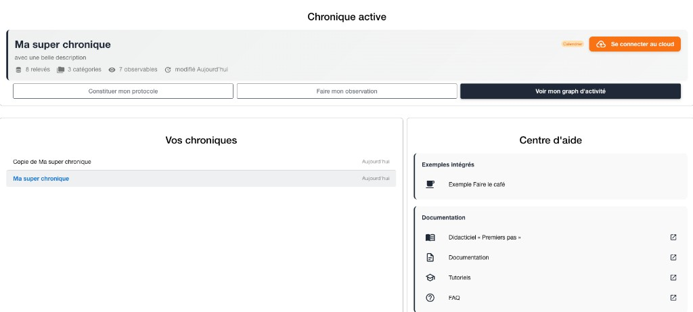

---

### H.1 — Chip mode avec les métadonnées

**Constat** : le chip Calendrier est poussé contre « Se connecter au cloud ». Le mode est une caractéristique de la chronique, pas une action de compte.

**Décision** : chip sur la **3e ligne** (relevés / catégories / observables / modifié).

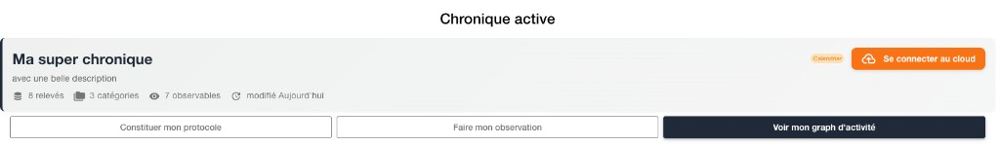

---

### H.6 / H.7 — Quatre CTA dans le bandeau

**Constat** : trois barres outline sous la carte ; Graphe plein (faux onglet actif) ; Stats absente ; les boutons sont **hors** du gris (div sous `.chronicle-header`).

**Décision** : les 4 CTA **entrent dans** le bandeau gris, sous les métadonnées. Tous au repos. Filet **accent**, fond blanc, coins `0.5rem` (même géométrie que le cloud, en négatif). Icônes du drawer + verbes. Pas de `isPrimary`. Graphe / Stats disabled s’il n’y a pas de relevés.

| Icône | CTA |
|-------|-----|
| `mdi-flask-outline` | Constituer mon protocole |
| `mdi-binoculars` | Faire mon observation |
| `mdi-chart-line` | Voir mon graphe d’activité |
| `mdi-chart-box` | Voir mes statistiques |

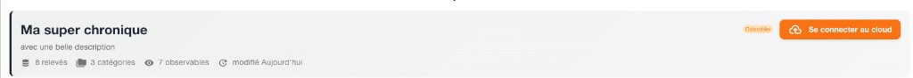

---

## 2. Drawer

### H.2 — Cloud : CTA orange + action fichier

**Constat** : Se connecter au cloud est collé à la chronique ouverte. C’est un login / une bibliothèque, pas une propriété du document.

**Décision**

- CTA **orange** sous **Nouvelle chronique** / **Importer depuis un fichier**.
  - Déconnecté : **Se connecter au cloud**
  - Connecté : **Accéder aux chroniques cloud**
- **Envoyer vers le cloud** dans le menu de la chronique ouverte, à côté d’Exporter.
- Plus de cloud sur la carte Chronique active.

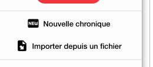

---

### H.3 — Bas du drawer

**Constat** : caption « Accès étudiant » ; menu compte en overlay sur la page ; Préférences à côté d’Aide ; Sauvegardes dans le menu compte.

**Décision**

```
Sauvegardes automatiques
Aide
Mon compte
  Licence étudiante
  ▾ (dans le drawer, vers le haut)
    Préférences
    Changer de licence
    Quitter
```

Menu = titre de modale : **Préférences** (`drawer.preferences`). Plus de « Préférences et affichage ».

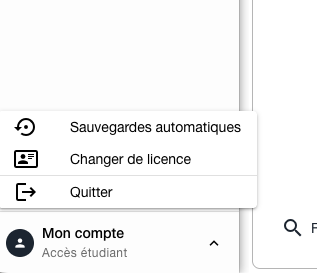

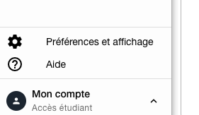

---

### M.1 — Exporter la chronique

**Constat** : le menu dit Exporter ; le panneau macOS dit Enregistrer sous (`NSSavePanel`, hors i18n).

**Décision** : garder **Exporter la chronique**.

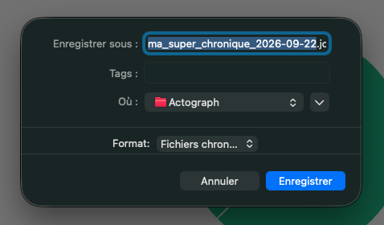

---

### M.2 / M.4 — Dupliquer

**Constat** : « Enregistrer sous » crée une **nouvelle** chronique (export + réimport). Modale trop large, champ qui dépasse, focus bleu Quasar.

**Décision**

| Surface | Cible |
|---------|-------|
| Menu | **Dupliquer** |
| Icône | **`mdi-content-duplicate`** |
| Tooltip | **Dupliquer la chronique ouverte** |
| Titre | **Dupliquer la chronique** |
| CTA | **Dupliquer** |
| Toast | **Chronique dupliquée** / **Erreur lors de la duplication** |
| Hint | **La chronique actuelle est conservée. Cette action crée une copie indépendante.** |
| Suffixe nom | `(copie)` (inchangé) |
| Taille | **`sm`** |
| Champ | contenu dans la carte (`q-gutter-y-md`) |
| Focus | **accent**, tous les `q-input` outlined |

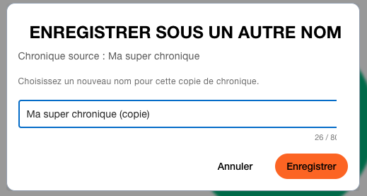

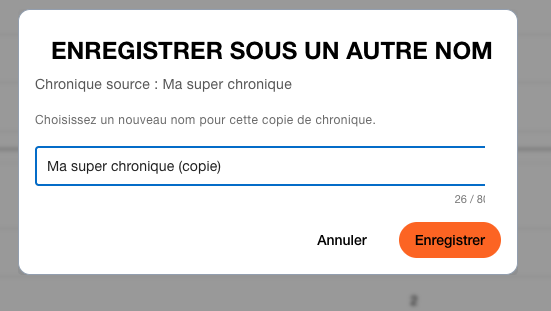

---

### M.3 — Fusionner

Parcours clair (deux chroniques + nom). **Inchangé.**

---

### H.4 — Modale connexion cloud

**Décision** : **retirée.** Le cloud est accessible à toutes les licences (payante ou non). Aucune caption du type « la licence étudiante n’inclut pas le cloud ». Ne pas l’ajouter.

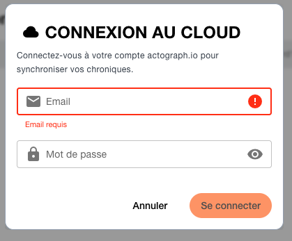

---

## 3. Protocole

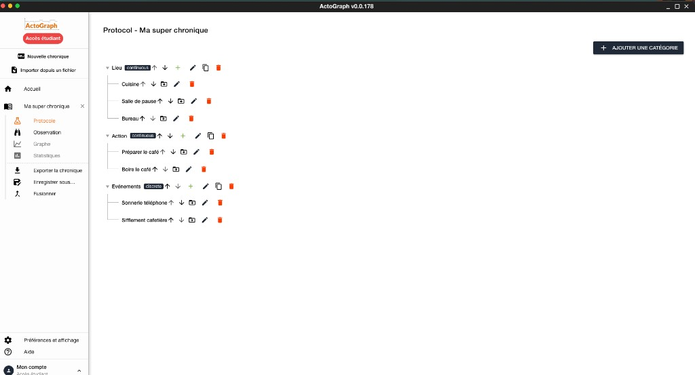

### P.1 — Titre

**Décision** : `Protocole - Ma super chronique` (plus `Protocol`).

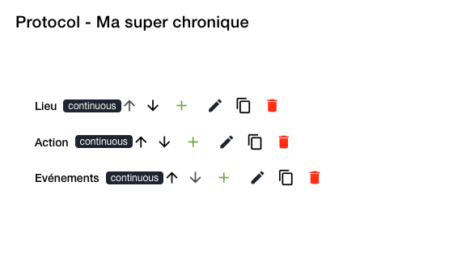

---

### P.2 — Type de catégorie

**Décision** : **continue** / **ponctuelle** partout (badge, select, édition, tooltips). Plus de `continuous` / `discrete` / « Ponctuel (événement) ».

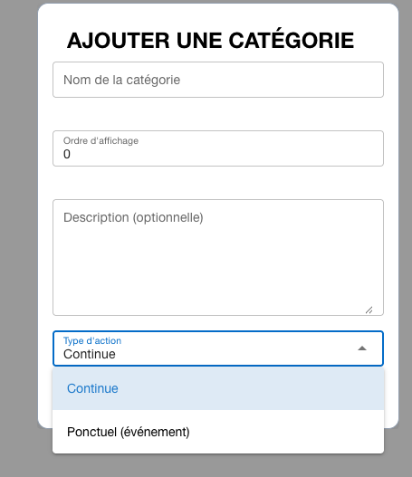

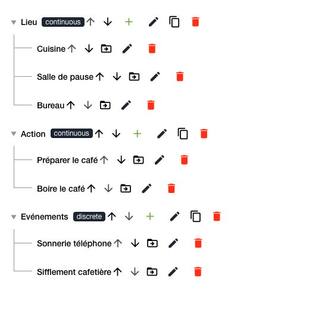

---

### P.3 — Grille d’actions

**Décision** : noms à gauche, actions **alignées à droite** (colonnes stables).

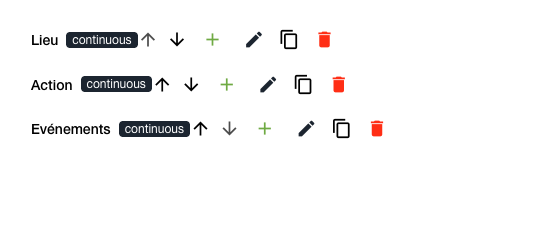

---

### P.4 / P.8 / P.9 — Saisie inline

**Constat** : modale one-shot + « + » ambigu + empty state anglais *No protocol items found*.

**Décision**

- Saisie **inline** (nom + description). Entrée = valider et nouvelle ligne. Échap = abandonner.
- Retirer le **+** de la ligne catégorie.
- Pas de champ ordre à l’ajout.
- Empty state, ton calme :

> Ajoutez au moins une catégorie, puis un ou plusieurs observables.

  La page vide **porte déjà** le champ de la première catégorie.

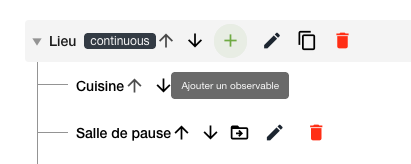

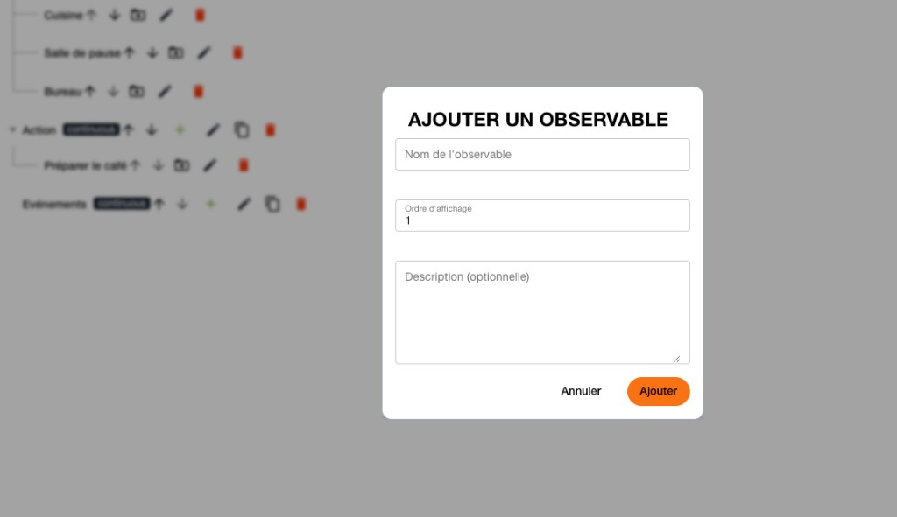

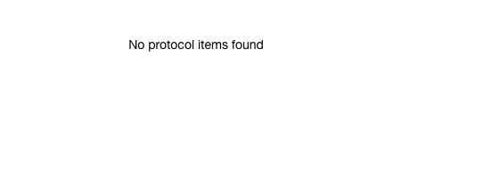

---

### P.5 / P.6 — Ordre

**Constat** : le champ propose `length` (0-based) → `0` si vide, `3` au lieu de `4`. Flèches haut/bas pour réordonner.

**Décision** : pas de champ ordre à l’ajout (P.8). Réordonnancement par **drag and drop** ; flèches en complément clavier. Les captures documentent le bug de la modale, plus le flux cible.

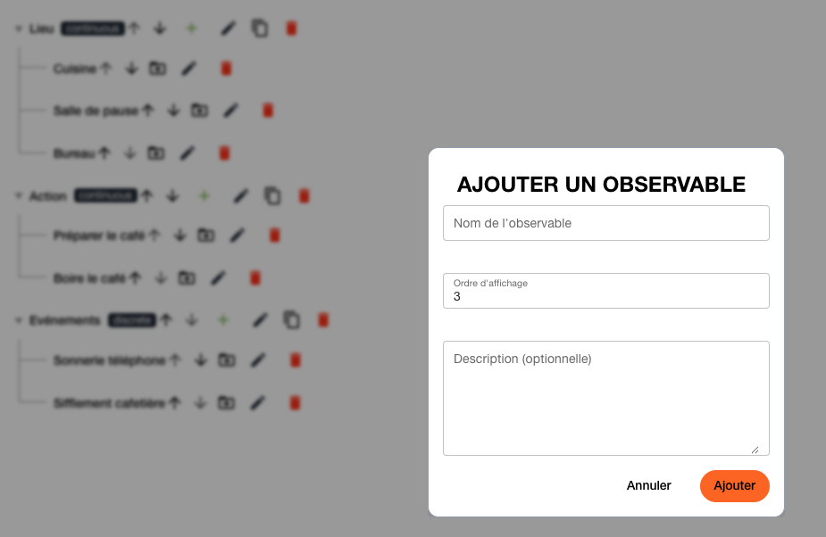

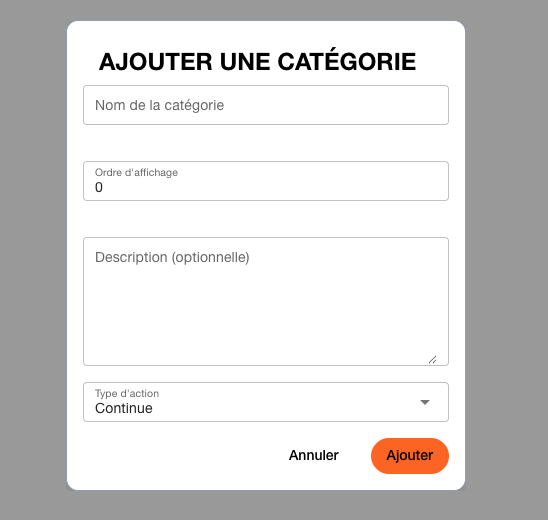

---

### P.7 — Sortie vers l’observation

**Décision** : CTA **Aller à l’observation** (navigation, pas Rec).

---

## 4. Observation

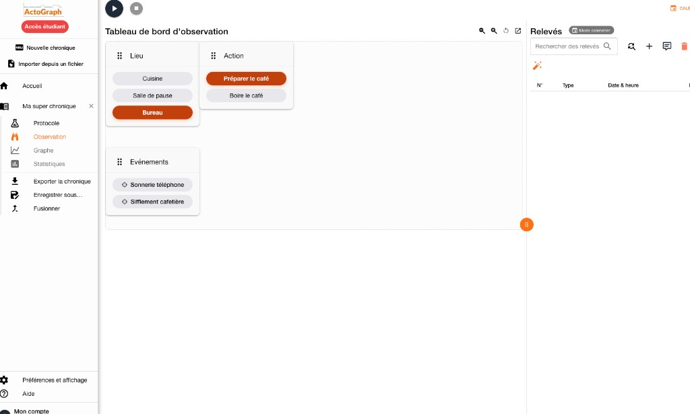

### O.1 / O.2 / O.3 / O.5 — Session

**Constat** : play/stop en icônes, coin haut gauche, introuvables. Stop écrit une Fin sans le dire ; le play réapparaît (on croit à une pause). Timer dans Relevés.

**Décision**

- **Rec** (rouge) · **Pause** · **Terminer**, plus le **timer**, dans une **barre sous le titre** gauche.
- Pause = geler, même session. Terminer = Fin + confirmation. Rec après Terminer = nouveau segment, dit à l’écran.
- Toaster : « Observation en pause » / « Observation terminée ».

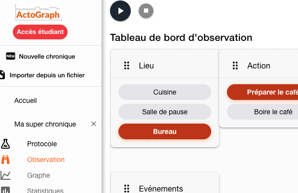

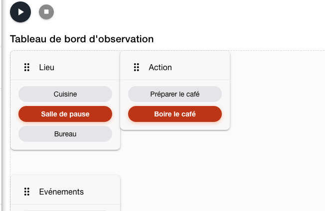

---

### O.6 / O.11 — Chrome gauche / titres

**Décision**

| | Gauche | Droite |
|---|--------|--------|
| Ligne 1 | Titre Tableau de bord d'observation | Titre Relevés |
| Ligne 2 | Rec / Pause / Terminer + timer + **Réinitialiser la disposition** (libellé) | Ajouter relevé / commentaire / auto-correct |
| Ensuite | − / + (échelle, `q-tooltip`) ; plateau ; **Détacher sur le cadre des cartes** | Recherche, alerte, tableau |

Titres **sur la même ligne**. Tooltip Détacher : « Détacher les boutons ».

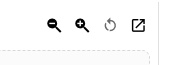

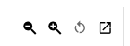

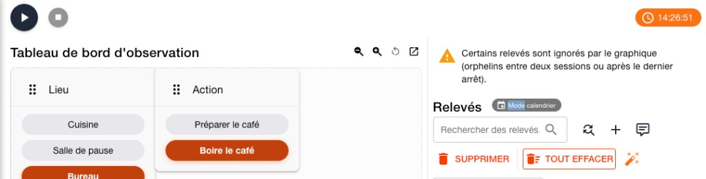

---

### O.4 / O.7 — Relevés

**Décision**

- Poubelle **par ligne**. **Tout effacer** en bas, avec confirmation. Plus de Supprimer (sélection).
- Barre d’actions : ajouter relevé · commentaire · auto-correct. **Pas** find/replace là.
- Recherche = filtre. Remplacer = expansion **du même champ** (compteur, Remplacer, Tout remplacer + confirmation). Cmd+F focus ce champ.

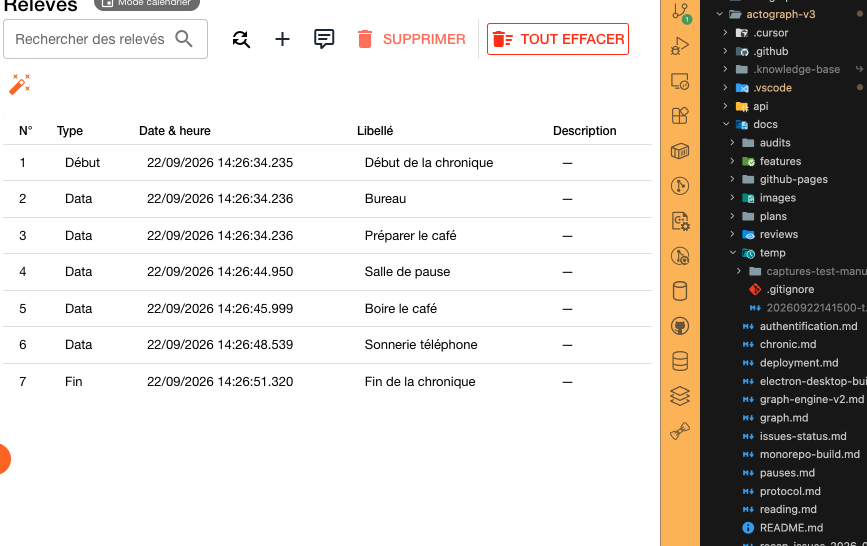

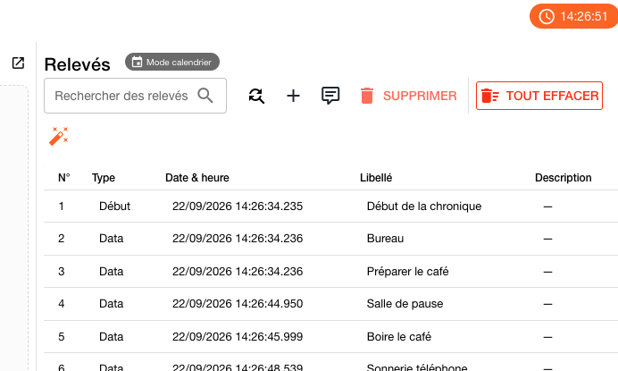

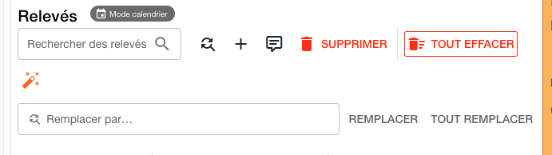

---

### O.8 — Date / heure

**Décision** : deux champs (date, heure+ms), icônes **prepend**. Annuler / Valider (i18n). Pas de titre visuel en calendrier. Pas de hint masque.

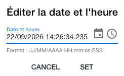

---

### O.9 — Chip mode

**Décision** : le cacher une fois l’observation démarrée. Le sélecteur Calendrier / Chronomètre reste **avant** le premier START.

---

### O.10 — Alerte orphelins (placement local)

**Décision** : juste **au-dessus du tableau**, après titre / actions / recherche. Composant partagé : S.1.

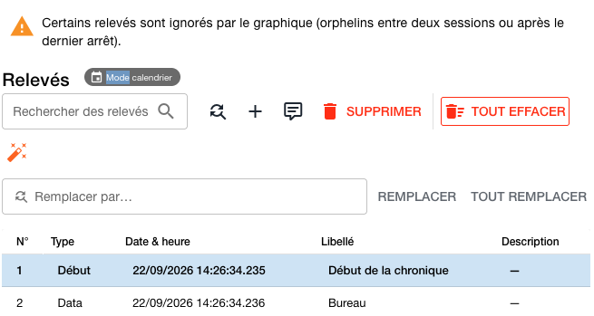

---

## 5. Graphe

### G.1 / E.1 — Barre et export

**Décision**

- Groupe **affichage à gauche** : − · + · Ajuster l’affichage.
- **Export : icône download à droite** du header (Graphe et Stats). Tooltip « Exporter ». Plus de label texte.
- Composant **`ExportMenu`** : radios contenu (si besoin) → toggle format si ≥ 2 → CTA Exporter. **0 choix** → clic = export, pas de menu.
- S.4 : même icône dans l’en-tête de **carte**, hors du plot.

G.1 « reset + export à gauche » est **ajusté** : le reset reste avec l’affichage / la vue ; l’export est à droite (fichier).

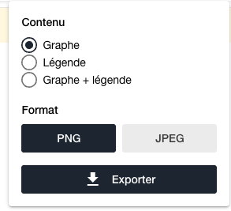

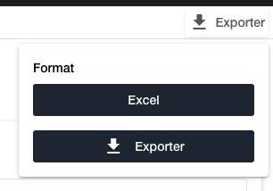

---

### G.2 — Format du temps

**Décision** : dans **Ajuster l’affichage**, section Axe du temps (avec l’étirement). Plus de select dans la toolbar.

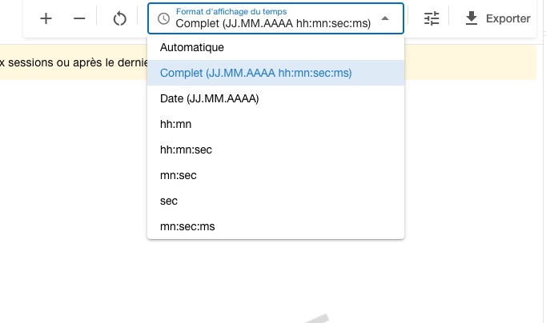

---

### G.3 — Headers

**Décision** : même hauteur L/R, un seul filet sous le titre à droite.

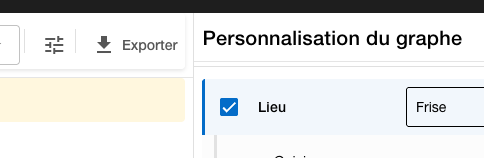

---

### G.4 — Mode d’affichage

**Décision** : catégories **continues** — icônes **sous** le titre (Normal / Frise / Arrière-plan), état actif visible, tooltip, sous-menu support pour l’arrière-plan. **Ponctuelles** : pas de contrôle.

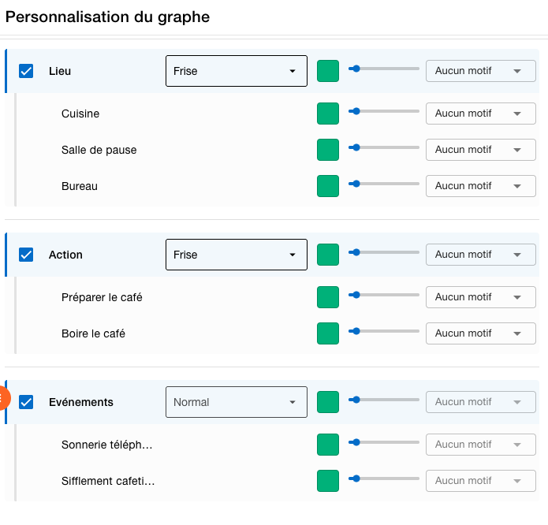

---

### G.5 — Épaisseur

**Décision** : `1 px` — curseur — `10 px`.

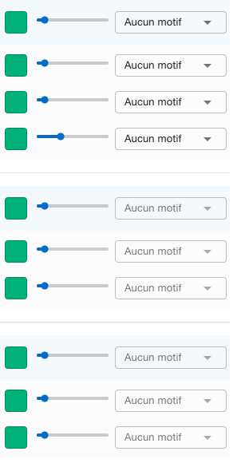

---

### G.6 — Couleurs

**Décision** : à la création, **une couleur par catégorie** (palette). Les observables héritent. Un enfant déjà recalé **garde** sa couleur si on change la catégorie.

---

### G.7 — Motif

**Décision** : **Uni** (plus « Aucun motif »).

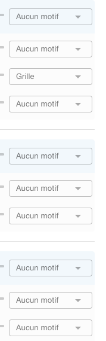

---

## 6. Statistiques

### S.1 — Alerte orphelins

**Décision** : **un composant** (Observation, Graphe, Statistiques). Même wording. Placement local (O.10 sur les relevés).

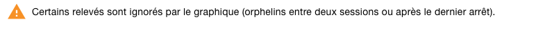

---

### S.2 / S.3 — Gouttière et onglets

**Décision** : même marge gauche / droite (onglets, export, alerte, cartes). Onglets = **segmented control** (pills), actif en fond.

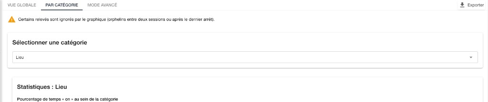

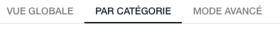

---

### S.4 — Export de carte

**Décision** : hors du plot, à droite du titre du graphique.

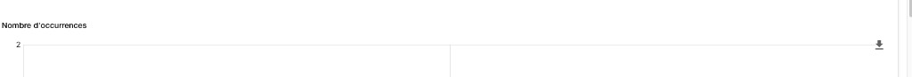

---

## 7. Aide

### I.1 — Version

**Décision / constat** : `APP_VERSION` lu dans `front/package.json` **au build**. **v0.0.178** est la bonne pour ce binaire. Prod : tag `prod-v…` → bump `package.json` → build (`publish.yml`). Pas de mise à jour live. « V3 » est en dur.

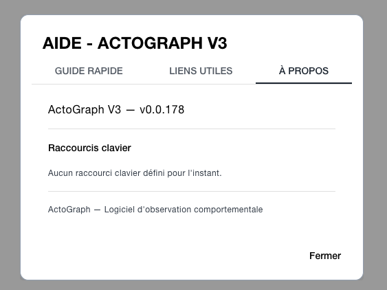
